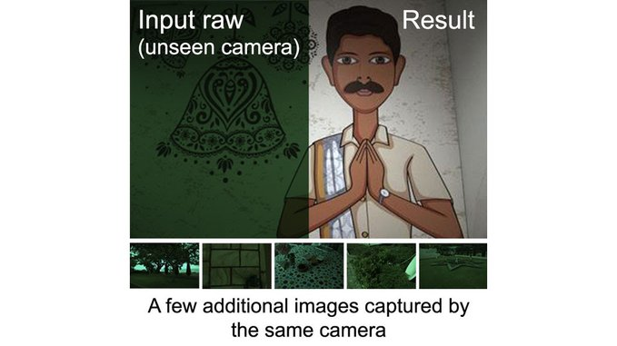
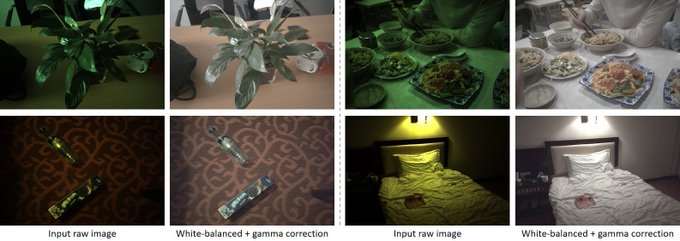

### 成果推荐及讨论
#### 8.8

- ##### [Mahmoud Afifi](https://twitter.com/mahmoudnafifi/status/1424180438101368835)
  Excited to announce that our paper on cross-camera color constancy has been accepted as an oral presentation at #ICCV2021
  
  
  abs: https://arxiv.org/pdf/2011.11890.pdf code: https://github.com/mahmoudnafifi/C5
  
  Main idea: With some extra (unlabeled) test-set images, you can build a hyper-network that calibrates itself at test time to previously unseen cameras.
  
  
### 意见性分享
#### 8.11

- ##### Jia-Bin-Huang:https://twitter.com/jbhuang0604/status/1425204888301150208

  **So You Think You Want to Apply for a PhD The application cycle is coming up. How do I maximize my chance of getting admitted to my dream program?  Check out the thread below for resources/advices/tips!**

  1.EVERYTHING you need to know about PhD applications! These videos are beyond awesome! (I wish I know these when I applied!)https://t.co/C4Q27vU9p9?amp=1

  2.Do NOT spend too much time maximizing your GPAs (e.g., by taking easy courses) or the Greatly Ridiculous Exam (GRE) scores. Show your potential of doing good research! Not sure if you love doing research yet? Then why are you applying?

  3.You won't be admitted to a program where there is no faculty who can be your advisor. Identify 1-3 potential advisors in the department (and mention them in your SOP). For CS applicants, check [http://csrankings.org](https://t.co/STYj6mNzWr?amp=1)

  Come on, it's 2021 already. Make a personal website where you can host all of your projects, experiences, and writing samples. Include your email so that people can reach out to you.

  

  

- ##### Andrea Tagliasacchi:https://twitter.com/taiyasaki/status/1425250276303282176

  ​    **I'm not sure how I feel about the fact that I can see other reviewer's identities at [#NeurIPS](https://twitter.com/hashtag/NeurIPS?src=hashtag_click)... how is that not biasing the review system? (i.e. junior folks altering their scores after seeing a senior providing a polarizing opinion)**

  ​     **Bruno Vilhena Adorno**: Are you guys able to see other reviewers' scores before providing yours? If yes, that will likely bias other reviewers. I like the idea of open reviews with full disclosure of identities, but I think reviews should be available to everyone only after everybody submitted theirs.

  ​     **Andrea Tagliasacchi**: You can change your scores after seeing others. And that should be possible, as another reviewer spotted a technical problem I did not (and that might change my opinion entirely...); but that's the point, it's the technical issue, not the "name" of who expressed it...

  ​    **Bruno Vilhena Adorno**: Totally agree. In that case, maybe a solution would be to disclose the reviews but not the reviewers' identities until the whole process is finished.

  ​    

- ##### Keenan Crane:https://twitter.com/keenanisalive/status/1425061350951243776

  ​    **There’s a lot of criticism of h-numbers, paper counts, citation metrics, “publish or perish”… yet we don’t lead by example. For the next generation (and my own mental health), I’ve at least deleted my Google Scholar profile. I pray you will judge me by the quality of my work.**

  ​    **Keenan Crane**: If you need bib entries or want to see what I’ve been working on lately, I’m very good about keeping my publications updated on my webpage: [http://cs.cmu.edu/~kmcrane/](https://t.co/G3ZRpsCYqA?amp=1)

  ​    **Nicolas Guarin**: I think that as an established researcher in your field this is not a problem for you. Nevertheless, for people starting it might be a problem. There are even some positions that explicitly request for your Google profile. I'm not saying that doing this is wrong, though.

  ​    **Bryce**: If I cannot see it, it does not exist. I don't understand the signalling here. If you actually wanted to fix these issues, you would be out there fixing them. Maybe the best just want to be working, and that's how it propagates. Heart disease, cancer, and H-indicies ...

  ​    **Antonio Rieser**: Unfortunately, in Mexico, which is typical for the developing world, not only is Google Scholar used for hiring, but it's also used for salary adjustments, and sometimes even enshrined (along with Scopus) in official evaluations. No one here can afford to give it up.

  ​    **Constantine Butakoff**: Its a bit weird as Google citations index is not very reliable and, not sure now, but used to include paper duplicates and self citations. Spanish ministry and public institutions rely more on scopus. Google's system is very much irrelevant.

  

- ##### Matthias Niessner:https://twitter.com/MattNiessner/status/1425479467779174403

    **The main reason why tech companies pay insane salaries and VCs invest crazy $$$ in AI/ML is simple: it's all about scalability! Do it once, sell to billions!  For large platforms, this means that even small improvements make a huge difference and justify pretty much any cost.**

  ​    **Kaushikpatnaik**: Also, AI becomes really good when it is 99.9% accurate (broadly speaking). It’s not as usable at 90%. When AI gets that good, it builds a flywheel where more people use it, which gives it more data to become better. Look at Bytedance

  ​    **Matthias Niessner**: Consequence: education cycles are signifanctly longer with much more up-front investment necessary (both time & money).  E.g., PhD degrees are often expected as in-depth knowledge and many years of training is required. But once part of it, opportunities become endless!

#### 8.13

- ##### Jia-Bin Huang:https://twitter.com/jbhuang0604/status/1426039195542360070

  **How to keep track with the literature? Getting started with research but overwhelmed by THOUSANDS of papers each year? How could one stay sane keeping track of the literature?  Here are some tricks I found useful.**

  1.*Track the people, not the papers* 

    There are far fewer key people who are driving the field forward than the number of papers. Check out who the authors are when you read papers. Overtime you will recognize the important ones.

  2.*Read papers with good related work* 

    A good related work section saves you so much time by providing a clear, organized view for prior work.  Side note: Please save others' time by writing a good related work.

  3.*Organize the papers* Don't read papers individually.

     Think about how are they related (similar in some aspects, but different in others). It often helps to build a table with columns specifying ATTRIBUTES.  With this table, reading new papers becomes easy (just add more rows).

  4.*Avoid reading the paper* 

    Instead of spending time reading the actual paper, find resources that are much easier to digest, e.g., a talk, a youtube video, teaser results, introductory video, or an overview figure.  Very often understanding the gist of the paper is all you need.

  5.*Read with a purpose* 

    Before investing time on reading a paper, think about WHY you are reading it. Are you reading for the experimental setup, the organization, the story, the style, the method, or the visualization?  You almost never need to read a paper from top to bottom.

  6.*Identify the trend* 

    Use your favorite tools to find what's hot/trendy, e.g.,  [http://arxiv-sanity.com](https://t.co/c9MzPyciO7?amp=1)  [https://paperswithcode.com](https://t.co/RkkPp3I3EQ?amp=1) [https://twitter.com](https://twitter.com/)

#### 8.17

- #####     Tomasz Malisiewicz：https://twitter.com/quantombone/status/1427638187145502726

  **I had a great chat this past weekend with [@AmirRubin](https://twitter.com/AmirRubin) about the intersection of 3D computervisionand digitaltwins. There are many intriguing ideas in this space, especially for me, who spent five years working on SLaM for MixedReality.**

  ​    **Amir Rubin**: We are at the very beginning of the impact 3D mapping+ SLAM will have on the future; Metaverse concepts will transform how we play and interact, but Digital Twins are the foundation for transforming industry!

     **Tomasz Malisiewicz**: I love [@AmirRubin](https://twitter.com/AmirRubin) ’s enthusiasm for wanting to learn about the power of deep learning when it comes to SLAM, SfM, and all things related to robotics. I miss in-person conferences during which we would dine, imbibe, and brainstorm!

#### 8.20

- ##### Marcus Brubaker:https://twitter.com/marcusabrubaker/status/1428423865907171333

  **Academic Twitter: What systems/processes do you use to keep track of papers for reading?  I want to be able to add a paper/blog post from anywhere (desktop, mobile, etc) and later browse or search by title/author/etc.  Should require minimal effort to add, avoid duplicates, etc.**

  **Sebastian Gerard**: I'm only on desktop, but Zotero lets you add anything with the click of a button (browser plugin), marks duplicates and searching works. It stores a copy of the PDF, which you can annotate. Bibtex export of the whole library is supported. Not an expert, but I'm happy so far.

  **Sebastian Gerard**: For processes: If I find something I want to read, I add it to Zotero, add a "todo" tag, which, in my config, adds a red marker to the paper title. I can also filter by tag ofc. To organize papers, I can add them to different "collections", use tags or link papers as "related".

#### 8.21

- #####   Srinath Sridhar:https://twitter.com/drsrinathsridha/status/1428775742943412233

  ​      **For someone so successful in the high-tech business, **[@elonmusk](https://twitter.com/elonmusk) **is surprisingly naive about AI/robots. We are decades away from building robots with the capabilities he claims in his prototype (human-level hands by 2022? good luck with that).**

  ​    **Michael Black**: People typically underestimate the importance of haptics. Without touch, you don’t have a hand. We still don’t have the sensors to recreate human-level touch. Then for real human-level hand control, you need vision. We’ve seen the overly optimistic claims about that before.

  ​    **Adam Maddox**: Why do we need a human level of touch? That seems like overengineering an unnecessary problem. Robots won't need it, likely just need to learn through object recognition how much pressure to apply when lifting objects without dropping/damaging the item. Depth perception does rest

  ​    **Michael Black**: To understand why vision is not enough for human-level dexterity, the famous Johannson experiment is illustrative. You can live a happy and productive life without vision. You can't live without touch.  [https://youtube.com/watch?v=HH6QD0MgqDQ](
